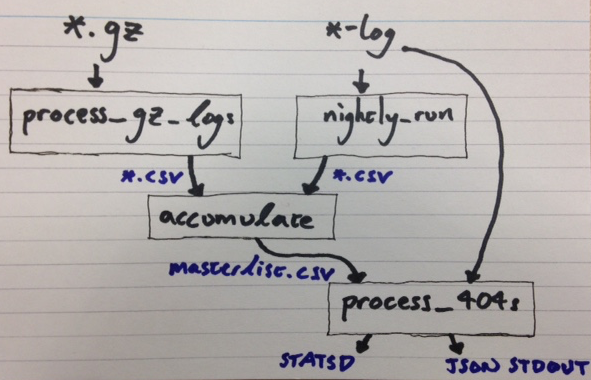

# CDN log monitor

Monitor the CDN logs for GOV.UK to find problems with the site.

This application is a collection of scripts that use:
* Historical and yesterday's cdn logs to calculate what pages are 'known good',
  that is, return HTTP status 2XX.
* The current log is used to monitor basepaths not being found, HTTP status
  404.

Processed logs become CSV files that contain basepath and frequency details.
The CSV files are combined into a masterfile of known good basepaths for GOV.UK

## Running

Each script accepts `-h` option that detail what the script expects.

`./process_404s.sh /src/log/directory /path/to/masterlist.csv`
* This script should be run continuously.
* Streams data from the latest uncompressed cdn log and compares it against the
  known good pages (masterlist) on GOV.UK.
* Alerts if a 404 occurs that should not.

`./nightly_run.sh /src/log/directory /output/csv/directory`
* This script should be run every day.
* Processes the latest uncompressed log file for pages returning HTTP 2XX
  statuses.
* Outputs the list of basepaths with a 2XX status to a csv file.

`./process_gz_logs.sh /src/gzipped/directory /output/csv/directory`
* Processes all the compressed historical logs into csv files
* There is no need to re-run this once all historical have been processed.

`./accumulate.sh /src/csv/directory /path/to/masterlist.csv`
* Should be run every day after `nightly_run` finishes
* Takes urls that are known to be good and adds them to the masterlist. The
  details of the algorithm used are in the ruby code that `accumulate` calls
* Updates a git repository with the new additions to the masterlist

`./owning_app.sh "/base/path"`
* Outputs the name of the application that 'owns' the html content at the
  specified basepath on gov.uk.

